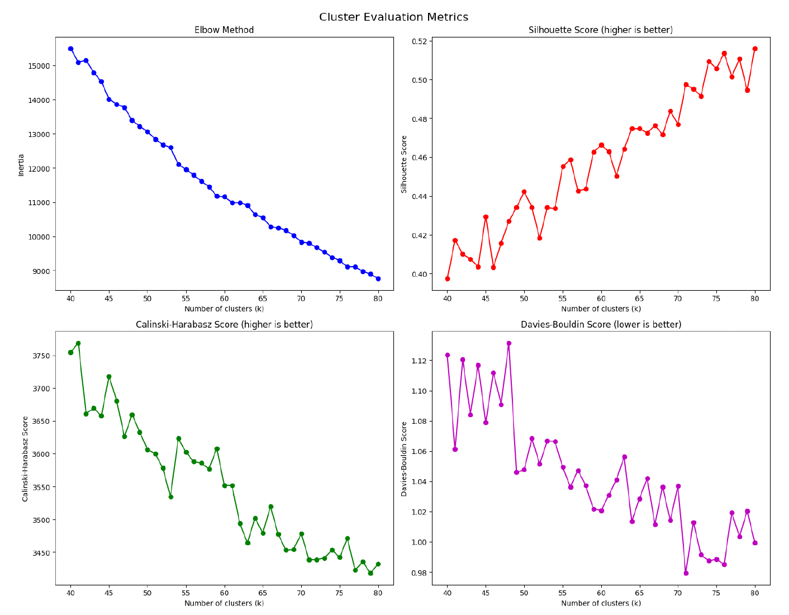
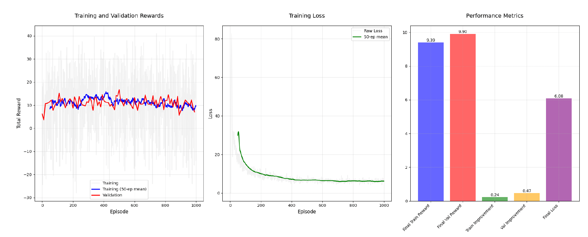
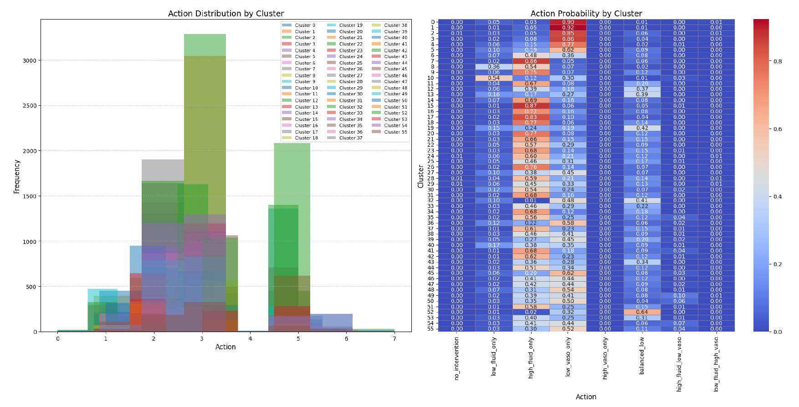
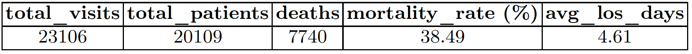
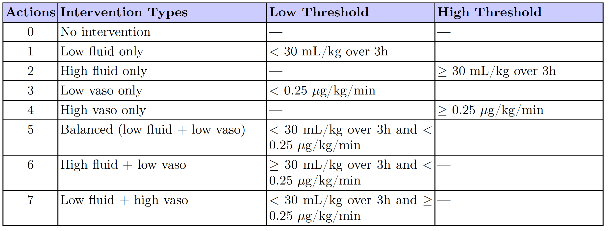
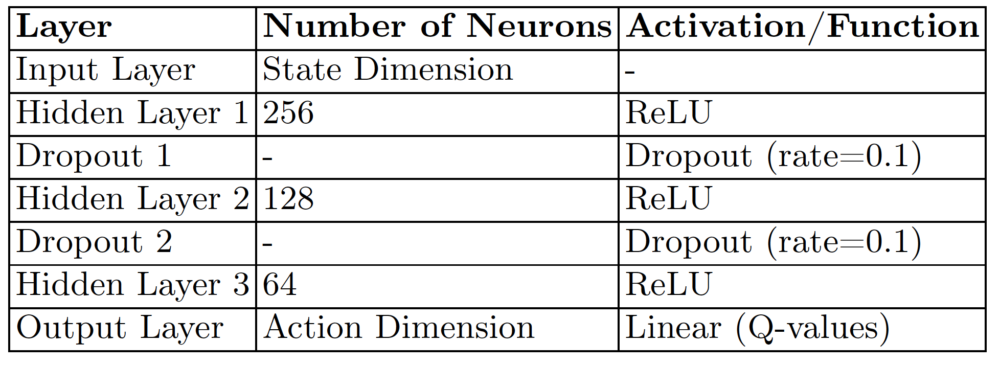

# Sepsis Management with Reinforcement Learning

This project develops a reinforcement learning framework to optimize intravenous fluid and vasopressor administration for septic shock patients in the ICU. Using the AmsterdamUMCdb dataset, we applied a Deep Q-Network (DQN) architecture in combination with patient clustering to personalize intervention strategies.

---

## 📁 Project Structure

| File/Folder              | Description                                      |
|--------------------------|--------------------------------------------------|
| `sepsis_management_dqn.ipynb` | Main analysis and modeling notebook           |
| `requirements.txt`       | List of python packages needed                   |
| `images/`                | Visualizations of results              |

---

## 🚀 Getting Started

### Clone the repository

```bash
git clone https://github.com/ES870/sepsis-management-dqn.git
```

### Install required packages
```bash
pip install -r requirements.txt
```

### Run the notebook
```bash
jupyter notebook
```

⚠️ Note: This project uses data from AmsterdamUMCdb. Access requires registration.

---

## 🧠 Methods & Techniques

- Data preprocessing and feature extraction
- Patient clustering (unsupervised learning)
- Deep Q-Networks (DQN)
- Markov Decision Processes (MDP)
- Reward shaping (SOFA scores & survival)

---

## ✅ Results
- Personalized treatment policies learned through reinforcement learning
- Promising steps toward data-driven clinical decision support in critical care

---

## 📊 Key Visuals

### 🔹 Cluster Evaluation Metrics

  
*Figure 1: Clustering metrics used to select the optimal number of patient groups, including Elbow, Silhouette, Calinski-Harabasz, and Davies-Bouldin indices.*

---

### 🔹 DQN Training Performance

  
*Figure 2: Training and validation reward curves (left), training loss (middle), and performance metrics across episodes (right) for the DQN agent.*

---

### 🔹 Action Distribution by Patient Cluster

  
*Figure 3: Heatmap showing action probabilities per cluster. Indicates how the RL agent tailors treatment policies to specific patient subgroups.*

---

### 🔹 Patient Statistics

  
*Table 1: Summary statistics for each cluster including mortality rate, patient count, and average ICU length of stay.*

---

### 🔹 Action Space Overview

  
*Table 2: Description of the 8 discrete actions used in the DQN environment, mapping each to specific ranges of vasopressor and IV fluid dosages.*

---

### 🔹 DQN Network Architecture

  
*Table 3: Overview of the Deep Q-Network architecture including layer types, activation functions, and output structure.*

---
## 📬 Contact
For questions or collaboration, feel free to reach out via [my homepage](https://estock2.wixsite.com/evastock/portfolio).


